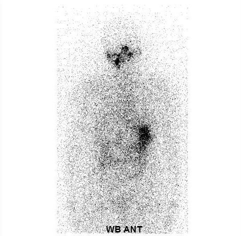
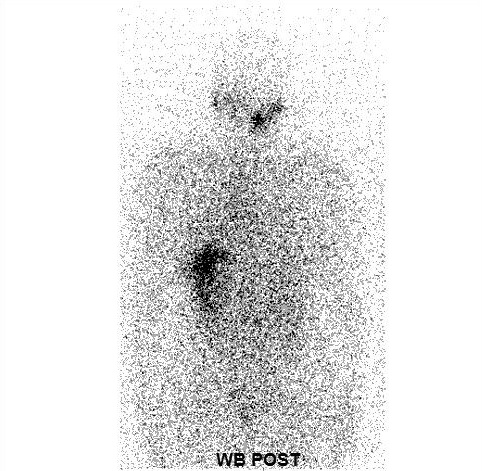

# Thyroid SPECT Dataset

Đối với UTTG, các lựa chọn điều trị tiêu chuẩn bao gồm phẫu thuật, điều trị bằng thuốc I-131 và liệu pháp ức chế TSH. 
Đối với những bệnh nhân có vấn đề về tuyến giáp, chụp xạ hình SPECT tuyến giáp thường được tiến hành 4-6 tuần sau khi cắt bỏ hoàn toàn tuyến giáp trước khi loại bỏ mô giáp còn sót lại bằng I-131.
Chụp xạ hình SPECT tuyến giáp sau phẫu thuật ở thời điểm này để đánh giá mức độ và phân bố của mô giáp còn lại sau phẫu thuật để từ đó đưa ra phương hướng điều trị phù hợp. Việc này sẽ sinh ra một bộ dữ liệu lớn và đòi hỏi cách xây dựng tập dữ liệu riêng về hình ảnh xạ hình SPECT tuyến giáp sau phẫu thuật và đi kèm với bệnh nhân trong suốt quá trình điều trị. Bộ dữ liệu về hình ảnh xạ hình SPECT tuyến giáp này hoàn toàn có thể sử dụng để áp dụng vào các mô hình CAD nhằm hỗ trợ các bác sỹ chẩn đoán hình ảnh y học hạt nhân. Mặc dù CAD đã đạt được kết quả nghiên cứu tích cực nhưng nó vẫn chưa được phê duyệt về mặt y tế. Một lý do có thể là hiện tại chưa có cơ sở dữ liệu chuẩn hóa để đánh giá các hệ thống hỗ trợ chẩn đoán. Hơn nữa, không thể xây dựng các mô hình CAD có độ chính xác cao trên các tập dữ liệu nhỏ.

## Thu thập dữ liệu

Bộ dữ liệu xây dựng được thu thập tại Khoa Y học hạt nhân, Bệnh viện TƯQĐ 108. Bộ dữ liệu bao gồm các ảnh SPECT tuyến giáp thu thập từ 9.500 ca chụp được thực hiện từ tháng 1/2020 đến 12/2024 (trung bình 30-40 ca/ngày). Đây là các ca chụp xạ hình tuyến giáp để loại bỏ mô tuyến giáp sau khi đã được phẫu thuật cắt bỏ toàn bộ tuyến giáp. Các hình ảnh xạ hình SPECT tuyến giáp này đã được phân tích, tư vấn của nhiều bác sĩ chuyên khoa và được sử dụng để điều trị cho bệnh nhân. Quá trình thu thập bộ dữ liệu cũng được sự phối hợp và hỗ trợ của Khoa Y học hạt nhân, Bệnh viện TƯQĐ 108.

Để bảo đảm tính chính xác và thống nhất trong toàn bộ tập dữ liệu, tác giả chỉ thu thập những ca chụp xạ hình thực hiện đúng theo quy trình xạ hình bằng máy SPECT như trình bày ở trên. Tất các bệnh nhân đều tiến hành chụp 2 hình ảnh trước (ANT) và sau (POST) tạo thành 1 cặp ảnh cho từng bệnh nhân. Những dữ liệu bệnh nhân chỉ chụp 1 hình ảnh đều bị loại bỏ. Các ca chụp có hình ảnh chụp xạ hình không đạt yêu cầu, những bệnh nhân đặc biệt kháng Iốt được phân loại bởi bác sĩ và kỹ thuật viên trưởng đều không được lấy vào nghiên cứu. Các dữ liệu khi đưa vào nghiên cứu phải đầy đủ các thông tin lâm sàng như tuổi, giới tính. Những dữ liệu không có, thiếu các thông tin trên hoặc thất lạc kết quả trả lời đều không được lấy vào nghiên cứu.  
Bộ dữ liệu nghiên cứu được lấy từ khoa Y học hạt nhân-Bệnh viện TWQĐ 108 bao gồm 9.500 ca chụp xạ hình SPECT tuyến giáp từ năm 2020 tới 2024 trên các máy chụp xạ hình SPECT tuyến giáp được thống kê theo bảng 1. Dữ liệu này là kết quả sau hội chẩn của nhiều bác sĩ có trên 10 năm kinh nghiệm về chẩn đoán hình ảnh y học hạt nhân và đây cũng là cơ sở để điều trị cho bệnh nhân. Nghiên cứu này được sự cho phép của Khoa Y học hạt nhân - Bệnh viện TWQĐ 108 để thực hiện.

***Bảng 1: Dữ liệu nghiên cứu***

|     | **Infinia** | **Optima 640** | **Milenium MG** | **Dương tính** | **Âm tính** |
|:-----|:------|:------|:------|:------|:------|
| Nam | 253 (28%) | 369 (29%) | 2146 (29%) | 2636 (28%) | 132 (39%) |
| Nữ  | 645 (72%) | 878 (71%) | 5209 (71%) | 6526 (71%) | 206 (61%) |
| **Tổng số** | **898** | **1247** | **7355** | **9162** | **338** |

### Thiết lập các thông số chụp:

- Chụp động toàn thân: Kích thước ảnh 256 x 1024, 15 phút/mét. 512 x 1024, 7 phút/mét ANT(ảnh phía trước)+POST(ảnh phía sau) tuyến giáp. Kỹ thuật này chụp toàn thân nhằm đánh giá được sự di căn của mô giáp xâm lấn sang các mô tạng khác trong cơ thể.

- Chụp tĩnh: Kích thước ảnh 256 x 256, 10 phút. ANT + POST. Kỹ thuật này bổ sung thêm khi có yêu cầu của bác sĩ đối với những ca chưa rõ ràng bắt xạ hay không ở tuyến giáp vùng cổ.

<!-- 

  

    
a) Ảnh SPECT phía trước (ANT)

    
    
  

  

    
b) Ảnh SPECT mặt sau (POST)

        
  

 -->
a) Ảnh SPECT phía trước (ANT)             |  b) Ảnh SPECT mặt sau (POST)
:-------------------------:|:-------------------------:
  |  

<i>Hình 1: Hình ảnh xạ hình SPECT từ bệnh nhân</i>

## Chi tiết

Mỗi một ca chụp sẽ được chụp đầy đủ cả 2 ảnh trước (ANT) và sau (POST), bác sỹ là người cuối cùng xem những ảnh này và đưa ra chẩn đoán từ những ảnh đó. Tất cả các ảnh dùng trong nghiên cứu này sẽ được loại bỏ phần thông tin bệnh nhân, chỉ để lại ảnh hiện thị và tên đánh dấu vị trí trước (ANT) và sau (POST) nhưng vẫn được lưu theo cặp của từng bệnh nhân. Hình ảnh vùng đầu cổ là ảnh đơn sắc 2D có kích thước là 256 x 256 điểm ảnh.

Xét trong tập dữ liệu: tác giả đã chọn từ 9.500 lấy 1.775 hình ảnh xạ hình SPECT tuyến giáp từ năm 2020 đến năm 2024 được cặp ảnh phía trước (ANT), phía sau (POST) theo yêu cầu về chuẩn dữ liệu để cho huấn luyện mô hình, tác giả đã xác định số lượng mẫu giữa lớp tăng hoạt tính phóng xạ và lớp không tăng hoạt tính phóng xạ là không chênh lệch nhau quá nhiều như chỉ ra trong Bảng 2.1. Điều này đã giúp mô hình mạng tránh được các lỗi nêu trên.

***Bảng 2: Sự phân bố số ca bệnh (tăng hoạt tính phóng xạ) và không bệnh (không tăng hoạt tính phóng xạ)***

| **Phân loại ảnh** | **Số lượng** | **Chiếm tỷ lệ (%)** |
| --- | --- | --- |
| Tăng hoạt tính phóng xạ (Dương tính) | 863 | 48.6 |
| Không tăng hoạt tính phóng xạ (Âm tính) | 912 | 51.4 |
